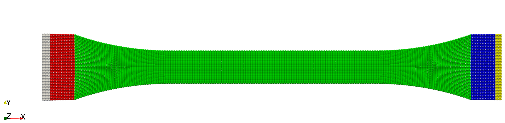
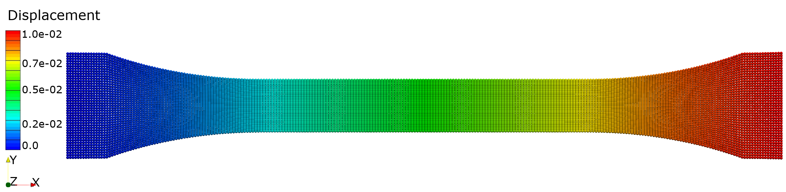
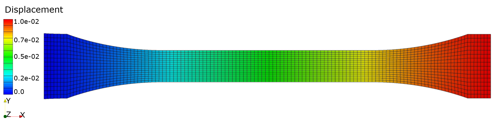
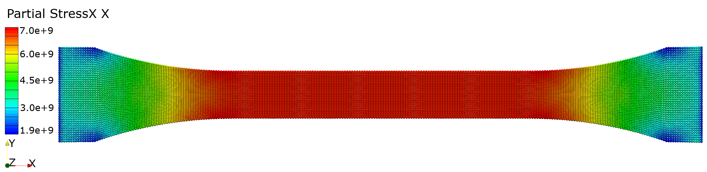
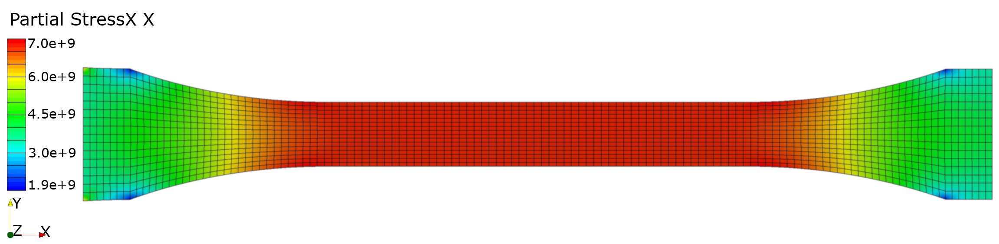

# Summary

In order to analyze complex and large scale structural mechanical
problems, simulation frameworks are required. These require material models to
assess the response of a medium to loading conditions. The type of
material model necessary depends on the physical problem, its
implementation and idealization in a structural model. Therefore, an
efficient way of using different kinds of material models in a
peridynamic simulation is required. 
In this paper a generalized user material interface is presented that allows the usage of existing as
well as novel material models.
In order to implement this interface, the material modeling of the correspondence formulation
in Peridigm was restructured. Local coordinates were added
and the unit tests were extended.


# Statement of need

The user material interface allows the simplified use of already
existing material routines in the peridynamic framework Peridigm. The
interface is based on the Abaqus UMAT definition [@Abaqus] and allows
the integration of Fortran routines directly into Peridigm. The
integration of UMAT routines based on finite elements in Peridigm
eliminates the need for parallel development of existing material models
from classical continuum mechanics theory. Thus, the same material model
implementations are applicable in finite element as well as peridynamic
simulations. This opens up new possibilities for analysis, verification
and comparison. With this interface many material routines can be reused
and applied to progressive failure analysis. The source code is stored
in a GitHub repository [@PeridigmGithub].\

# Introduction

Peridynamics is a non-local theory which overcomes the problems of classical continuum mechanics at discontinuities due to the necessity of spatial derivations of the underlying partial differential equations. The latter are not defined at discontinuities such as cracks. It is solved by
using an integral formulation instead of a differential one. As a
result, existing material models have to be rewritten. To improve the
usability of the Peridynamic theory in 2007 the so-called correspondence
formulation was developed by Silling et al. [@SillingSA2007]. This
formulation introduces a non-local integral deformation gradient which
allows the use of classical continuum mechanical models in Peridynamics.
The non-local deformation gradient allows the calculation of classical
strain and stress measures.\
Since, Peridynamics is motivated by the analysis of crack propagation
processes, a mesh-free method is usually used for the numerical solving
process. One of the more advanced frameworks is provided by Sandia
National Labs and is called Peridigm [@PeriDoX; @Parks2012]. The
framework allows the parallelization of large scale models and has a
post processing interface to the open source software ParaView[1]. Some
extensions were introduced in the recent years. Within this software
publication, e.g. energy based ordinary state-based damage model,
anisotropy, correspondence energy damage model
[@WillbergC2019; @WillbergC2021; @WillbergC2022] will be added to
Peridigm. However, the current structure of Peridigm does not allow the
direct use of already existing material models. Material models have to
be rewritten to use them in Peridigm. This holds true for classical peridynamic as well as correspondence material models. Abaqus is a general finite element solver that can be used to model different material behaviors. This software provides an interface to include user materials (UMAT). UMATs usually are written in Fortran
and it is the quasi standard in this research domain, although
alternative formats exist. Therefore, the goal of this publication is
the provision of a direct Peridigm - Abaqus UMAT interface. This interface reduces the hurdle of material modeling in Peridynamics and increases the advantages of the Peridigm framework significantly. The approach presented here follows a setup that allows easy extension to other material models as well as languages.

# Implementation and architecture

The user material interface is motivated by the Abaqus UMAT interface. Before the material routine can be used, the strain values have to be transformed into local coordinates. The stress values, which are calculated via the fortran routine, are transformed back into the original coordinates. The \autoref{tb:Interfaceparameter} gives an overview about the interface and supported parameters. Obviously not all parameters are valid,
because they are specific to the finite element format.

Table: Interface parameter of the UMAT in Peridigm (PD). In Dogbone_Umat.yaml it
is shown how to call a user material with a user defined number of properties and
state variables.\label{tb:Interfaceparameter}

| Name | Type | Size | Description | Supported | 
|-|-|-|-|-|
| sigmaNP1 | double[ ] | ntens              | Mechanical stresses | yes |
| statev   | double[ ] | nstatev            | User defined state variables | yes |
| DDSDDE   | double[ ] | ntens$\times$ntens | Jacobian matrix of the constitutive model $\partial\boldsymbol{\sigma}/\partial\boldsymbol{\varepsilon}$ | no  |
| SSE      | double    | 1                  | Specific elastic strain energy                                     | no  |
| SPD      | double    | 1                  | Specific plastic dissipation                                       | no  |
| SCD      | double    | 1                  | Specific creep dissipation energy                                  | no  |
| RPL      | double    | 1                  | Volumetric heat generation per unit time                           | no  |
| DDSDDT   | double[ ] | ntens              | Variation of the stress increments with respect to the temperature | no  |
| DRPLDE   | double[ ] | ntens              | Variation of RPL with respect to the strain increment.             | no  |
| DRPLDT   | double    | 1                  | Variation of RPL with respect to the temperature                   | no  |
| stran    | double[ ] | ntens$\times$ntens | strain                                                             | yes |
| dstran   | double[ ] | ntens$\times$ntens | Strain increment                                                   | yes |
| time(1)  | double    | 1                  | Step time at the beginning of the current increment                | no  |
| time(2)  | double    | 1                  | Total time at the beginning of the current increment               | yes |
| dtime    | double    | 1                  | Time increment                                                     | yes |
| temp     | double    | 1                  | Temperature                                                        | yes |
| dtemp    | double    | 1                  | Temperature increment                                              | yes |
| PREDEF   | double[ ] | -                  | Predefined fields                                                  | no  |
| DPRED    | double[ ] | -                  | Array of increments of predefined field variables                  | no  |
| CMNAME   | string    | 80                 | Material name                                                      | yes |
| ndi      | int       | 2 or 3             | Number of direct stress components at this point                   | yes |
| nshr     | int       | 1 or 3             | Number of engineering shear stress components                      | yes |
| ntens    | int       | ndi+nshr           | Size of the stress or strain component array                       | yes |
| nstatev  | int       |                    | Number of state variables                                          | yes |
| props    | double[ ] | nprops             | Property values                                                    | yes |
| nprops   | int       | 1                  | Number of properties                                               | yes |
| coords   | double[ ] | 2 or 3             | Coordinates                                                        | yes |
| drot     | double[ ] | 3 $\times$ 3       | Rotation increment matrix                                          | yes |
| PNEWDT   | double    | 1                  | Ratio of suggested new time increment                              | no  |
| CELENT   | double    | 1                  | Characteristic element length                                      | no  |
| DFGRD0   | double[ ] | 3 $\times$ 3       | Deformation gradient N                                             | yes |
| DFGRD1   | double[ ] | 3 $\times$ 3       | Deformation gradient N+1                                           | yes |
| NOEL     | int       | 1                  | Element number                                                     |     |
| NPT      | int       | 1                  | Integration point number                                           |     |
| KSLAY    | int       | 1                  | Layer number                                                       |     |
| KSPT     | int       | 1                  | Section point number                                               | no  |
| JSTEP    | int       | 1                  | Step number                                                        | no  |
| KINC     | int       | 1                  | Increment number                                                   | no  |

The overall interface architecture is given in \autoref{fig:umlschema}. The Peridigm user material is
structured like a typical material used in Peridigm. In order to be able to use a
material routine, the UMAT file must be precompiled and copied to a
specific folder. An additional interface layer is introduced. It is used
to transform or calculate specific parameters for the UMAT. Because, the
material name is not transferable directly from Peridigm which is written in C++ to Fortran, a
dedicated Fortran routine is provided. This routine transforms the
string definition of C++ to the character field definition of Fortran.\
The interface allows an arbitrary number of properties and state
variables. The definition is shown in the Listing below or in the example, which is given in the
repository. The state variables allow specific calculations,
e.g. the history of a discrete material response or property. These state variables can be saved and requested for output in the output section of the Peridigm input file.


Listing 1: Yaml interface to call the UMAT with name (User Material Name), three properties and three state variables.\label{lst:mat}
```
Materials:
  User Material Name:
    Material Model: "User Correspondence"
    Plane Strain: false
    Plane Stress: True
    Density: 2.7e+03
    Young's Modulus: 7.24e+10
    Poisson's Ratio: 3.3e-01
    Number of Properties: 3
    Prop_1: 1.0727111897390535e+11
    Prop_2: 5.2835028748341446e+10
    Prop_3: 2.721804511278195e+10
    Number of State Vars: 3
```

Listing 2: Yaml interface export state parameter.\label{lst:out}
```
Output:
    Output File Type: "ExodusII"
    Output Filename: "Example"
    Output Frequency: 1
    Output Variables:
      State_Parameter_Field_1: true
      State_Parameter_Field_2: true
      State_Parameter_Field_3: false
      Displacements: true
```

# Example

\autoref{fig:dogbone} shows the example provided in the repository. The user material is defined with properties the above properties. Property one is the
P-wave modulus, property 2 is Lames first parameter and the third
property is the Shear Modulus. The dogbone is loaded under tension by
applying a $u_1(x_1 = l)=0.01m$ displacement at the
right-hand side. All translations on the boundary condition application
region on the left of the specimen are fixed.



The material routine is utilized in Peridigm and Abaqus. \autoref{fig:displacementPeridigm} and \autoref{fig:displacementAbaqus} shows the
resulting displacement. As expected the results are identical. This is
because the $u_1$ displacement was applied as boundary condition. \autoref{fig:stress11Peridigm} and \autoref{fig:stress11Abaqus} illustrate the $\sigma_{11}$ stress distribution. There are some
differences between both results. The numerical representation between
Peridigm and Abaqus is different. Boundary conditions cannot be applied
in the same way, because each point in the peridynamic model represents
a volume. Surface boundary conditions lead to an error. Another
difference is not of numerical nature. The classical continuum mechanics
theory and Peridynamics are different formulations and also if fully
converged will lead to minor differences.









# Quality control

Multiple test routines are provided for the interface. They are based on
the existing Peridigm CMake test environment. In combination with the
use of CTest the user can make sure that the Fortran interface is
working as expected.

Two unit tests and one functional test are implemented. The first unit
test is required to ensure that all tensors are translated into a Voigt
notation and returned as a full tensor. The second unit test is able to
control the correct passing of variables in and from the Fortran
interface. Therefore, a test user material library, which modifies every
parameter by a defined value, was compiled. If the returned values are
as expected the Fortran interface and the property definition is
working.

In addition, full testing ensures that the user material implementation
works across the Peridigm framework. Hence, the test will compare an
exodus result file which is based on a predefined Peridigm material
model and a file which is the result of the user material model. Both
material models are similar. If the exodus results are within a defined
tolerance the test will pass. As reference a dogbone model as shown in \autoref{fig:dogbone},
the compiled fortran routine and the exodus result file can be found in
the referenced Zenodo archive.

# Availability

# Operating system

Linux

# Programming language

**C++**, Fortran 90

# Additional system requirements

2 GHz (Dual Core), 2 GB RAM, 5 GB available space

# Dependencies

Trilinos 13.2.0, HDF5 1.12.0, NetCDF 4.8.0, CMake 3.20.5

# List of contributors

Christian Willberg, christian.willberg\@dlr.de, German Aerospace Center\
Jan-Timo Hesse, jan-timo.hesse\@dlr.de, German Aerospace Center\

## Software location:

### Name:

- Zenodo

### Persistent identifier:

- https://doi.org/10.5281/zenodo.6418265

### License:

- BSD

### Publisher:

- Jan-Timo Hesse

### Version published:

- 0.1

### Date published:

- 06/04/2022

## Code repository

### Name:

- GitHub

### Persistent identifier:

- https://github.com/PeriHub/Peridigm

### License:

- BSD

### Date published:

- 04/04/2022

## Language

- English

# Reuse potential

A possibility to directly apply user defined material models in Peridigm
eliminates the need for duplicate development of existing material
models from classical continuum mechanics. Many material models can now
be used both in finite element methods and in Peridynamics. This opens
up new analysis, verification and comparison possibilities. The
application of the UMAT interface is done by a pre-compiled Fortran
material routine. This is deposited in the calculation folder. This
library is copied to the correct place and used for the calculation of
the material.

# Acknowledgements

The authors like to acknowledge the development team of the original
Peridigm framework (David J. Littlewood, djlittl\@sandia.gov, John A.
Mitchell, jamitch\@sandia.gov, Michael L. Parks,
mlparks\@sandia.gov,Stewart A. Silling, sasilli\@sandia.gov)
[@Parks2012].

# Funding statement

The work was funded by the German Research Foundation funded project:
"Gekoppelte Peridynamik-Finite-Elemente-Simulationen zur
Schädigungsanalyse von Faserverbundstrukturen" Grant number: WI 4835/5-1
and the M-ERA.NET funded project Exploring Multi-Method Analysis of
composite structures and joints under consideration of uncertainties
engineering and processing (EMMA)\
{ width=20% }\
This measure is co-financed with tax funds on the basis of the budget
passed by the Saxon state parliament. Grant number: 3028223. The authors
like to thank for the funding.

# Competing interests

The authors declare that they have no competing interests.

------------------------------------------------------------------------

**Copyright Notice**\
Authors who publish with this journal agree to the following terms:\
Authors retain copyright and grant the journal right of first
publication with the work simultaneously licensed under a [Creative
Commons Attribution
License](http://creativecommons.org/licenses/by/3.0/) that allows others
to share the work with an acknowledgement of the work's authorship and
initial publication in this journal.\
Authors are able to enter into separate, additional contractual
arrangements for the non-exclusive distribution of the journal's
published version of the work (e.g., post it to an institutional
repository or publish it in a book), with an acknowledgement of its
initial publication in this journal.\
By submitting this paper you agree to the terms of this Copyright
Notice, which will apply to this submission if and when it is published
by this journal.

[1]: https://www.paraview.org/ access date: 07/03/2022
